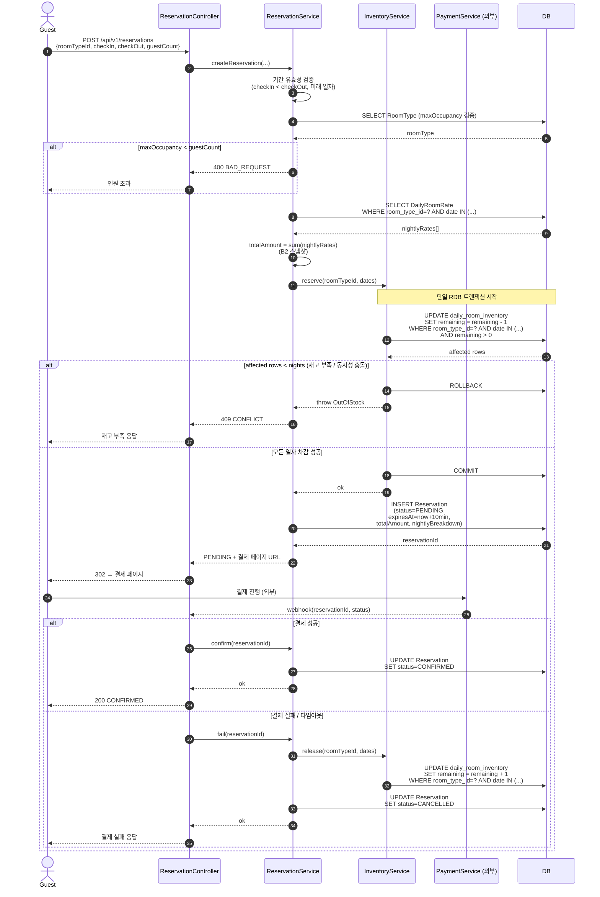
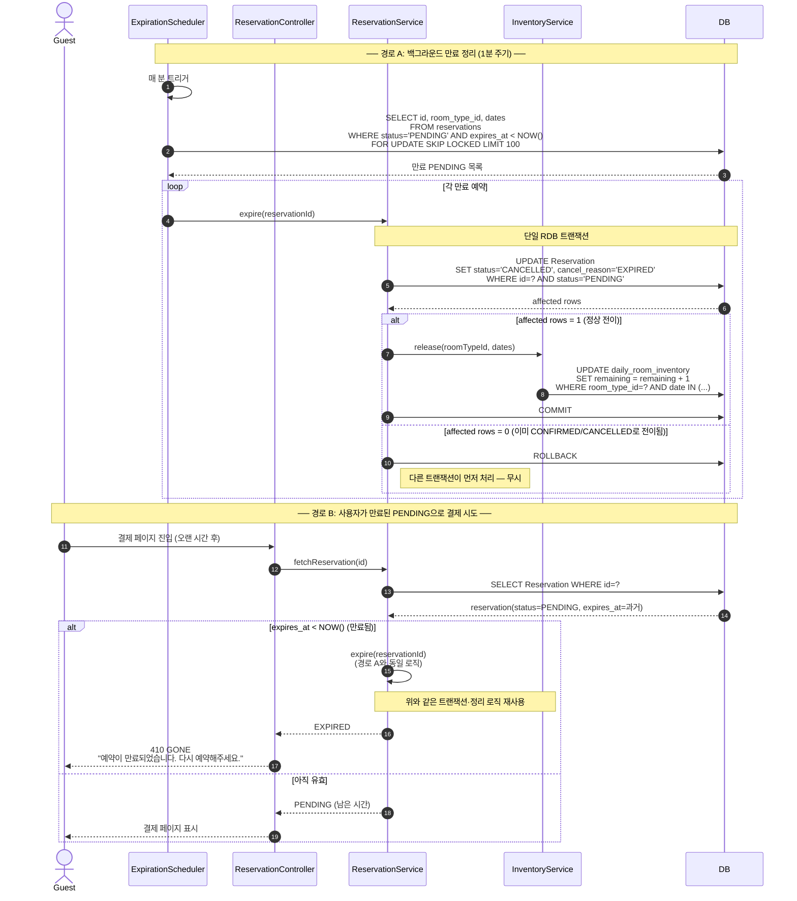
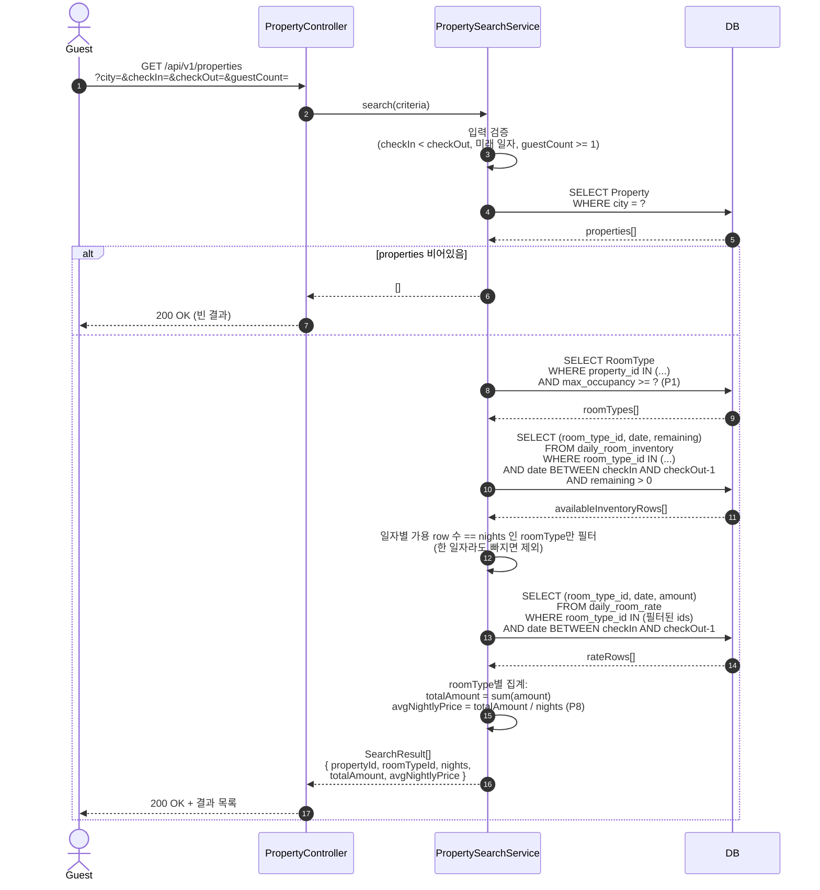
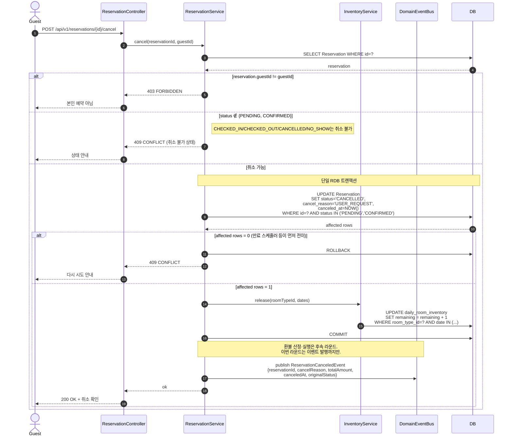

# 02. 시퀀스 다이어그램

> 기준 문서: `01-requirements.md`
> 다이어그램 작성 기준: `.claude/skills/requirements-analysis/SKILL.md` § 5️⃣
> 표현: Mermaid `sequenceDiagram`

---

## 0. 시퀀스 작성 결정사항 (B5)

- **B5 = A** — 단일 RDB 트랜잭션 + atomic UPDATE.
- `InventoryService.reserve(roomTypeId, dates)`는 다음 SQL을 트랜잭션 안에서 1회 실행:

  ```sql
  UPDATE daily_room_inventory
     SET remaining = remaining - 1
   WHERE room_type_id = ?
     AND date IN (?, ?, ...)
     AND remaining > 0;
  ```

- `affected rows == nights` 면 성공, 그 외에는 즉시 롤백 → `OutOfStock` 예외. 부분 차감 상태가 남지 않는다.
- 트랜잭션 경계는 `InventoryService` 내부에서 시작·종료. `Reservation` 도메인은 결과만 받는다.

## 시퀀스 목록

1. **예약 생성 + 결제** (PENDING → CONFIRMED / CANCELLED)
2. **PENDING 만료 + 재고 복구** (스케줄러)
3. **검색 + 가격 합산**
4. **수동 취소** (PENDING / CONFIRMED → CANCELLED)

---

## 1. 예약 생성 + 결제 (가장 핵심 흐름)

### 이 다이어그램이 필요한 이유

- 요구사항의 4개 축 — 검색·예약·재고·상태 머신 — 중 **상태 머신과 재고가 외부 결제 시스템과 맞물리는 가장 위험한 구간**.
- "더블부킹 방지", "결제·예약·재고 일관성", "PENDING 소프트 홀드" 세 가지 합의가 시퀀스에 명시되는지 검증한다.

### 다이어그램



### 이 구조에서 특히 봐야 할 포인트

1. **재고 차감이 Reservation INSERT보다 먼저** — 차감 실패 시 Reservation 레코드 자체가 생성되지 않는다. "PENDING이 존재하면 재고는 반드시 점유되어 있다"는 invariant 유지.
2. **PG 호출은 트랜잭션 경계 밖** — 외부 시스템 호출을 DB 트랜잭션 안에 두지 않는다. 결제 결과는 비동기 webhook으로 받아 별도 트랜잭션으로 상태 전이.
3. **release(보상)는 결제 실패 경로에서만 발동** — 정상 흐름에서는 release 호출 없음. PENDING이 만료되는 경로는 시퀀스 2에서 다룬다.
4. **`affected rows < nights` 분기가 더블부킹 방지의 핵심** — atomic SQL 결과로 동시성 충돌이 자연스럽게 검출됨. 별도 락 불필요.

### 잠재 리스크 (이 시퀀스에 한정)

- **PG webhook 유실** — 결제는 성공했는데 webhook이 안 오면 PENDING이 영원히 남는다. → 시퀀스 2의 만료 스케줄러가 안전망. 단, 그 사이 결제 성공 사용자에게 "결제 실패로 취소됨" 응답이 갈 위험.
- **webhook 중복** — 같은 결제에 대해 webhook이 두 번 오면 confirm/fail이 중복 실행될 수 있음. `Reservation.status`의 전이 invariant로 방어 (PENDING이 아니면 무시).
- **시계 불일치** — 만료 판정의 기준이 서버 시계라 멀티 인스턴스 간 클럭 스큐로 만료 직전·직후 결제가 애매하게 동작할 수 있음. UTC 기준 사용 + NTP 동기화 가정.

---

## 2. PENDING 만료 + 재고 복구

### 이 다이어그램이 필요한 이유

- 시퀀스 1의 PENDING 소프트 홀드(P4=A, 10분)가 **누구에 의해 어떻게 회수되는지**를 명시한다.
- 두 경로(① 사용자가 만료된 PENDING으로 결제 재시도 / ② 백그라운드 스케줄러)가 동시에 같은 PENDING을 정리할 때 race가 생기지 않는지 검증한다.

### 다이어그램



### 이 구조에서 특히 봐야 할 포인트

1. **만료 정리 로직은 `expire(reservationId)` 한 곳에 응집** — 스케줄러와 사용자 결제 시도 시점이 같은 함수를 호출. 분기를 두 군데에 두지 않는다.
2. **`UPDATE ... WHERE status='PENDING'` 조건이 race 가드** — affected rows = 0이면 "다른 트랜잭션이 먼저 전이시킴" 으로 판정. 결제 webhook과 만료 스케줄러가 동시에 같은 예약을 건드려도 한 쪽만 성공.
3. **`FOR UPDATE SKIP LOCKED`로 스케줄러 다중 인스턴스 안전** — 두 인스턴스가 동시에 실행돼도 잠긴 행은 다음 인스턴스가 건너뜀.
4. **`cancel_reason` 컬럼으로 만료/수동 취소/노쇼 구분** — 후속 라운드의 환불 정책이 cancel_reason을 분기 키로 사용.

### 잠재 리스크 (이 시퀀스에 한정)

- **결제 성공 webhook이 만료 직후 도착** — webhook이 만료 timer 직후 도착하면 PENDING → CONFIRMED 전이가 `affected rows = 0`으로 실패. 사용자는 결제됐는데 예약은 취소된 상태. → 보정 절차: webhook 처리에서 status=CANCELLED + cancel_reason=EXPIRED를 감지하면 환불 큐로 라우팅. 이번 라운드는 검출·로깅만 정의, 환불 자동화는 후속.
- **스케줄러 주기 vs 만료 정확도** — 1분 주기이므로 최대 1분간 만료된 PENDING이 살아있을 수 있음. 경로 B(사용자 진입 시점 검사)가 이 갭을 메움.
- **대량 만료 발생 시 N+1 release** — 한 번에 100건 정리 시 release SQL이 100회 발사. 인덱스(`room_type_id, date`)가 없으면 부하 급증. ERD 단계에서 인덱스 명시 필요.

---

## 3. 검색 + 가격 합산

### 이 다이어그램이 필요한 이유

- 요구사항 첫 줄(도시/체크인/체크아웃/인원수 검색 + 합산·평균 가격 표시)이 어떻게 데이터 조회로 구체화되는지 확인한다.
- "재고가 0인 일자가 하루라도 있으면 그 RoomType은 검색 결과에서 제외" 규칙을 명시한다.
- 검색은 동시성 보장이 필요 없는 **읽기 전용 hint** 라는 점을 부각 (실제 점유는 예약 시점에서만 일어남).

### 다이어그램



### 이 구조에서 특히 봐야 할 포인트

1. **IN 절 기반 일괄 조회로 N+1 회피** — Property → RoomType → Inventory → Rate가 4 SELECT지만 각 단계마다 `IN (...)`으로 묶어 호출 횟수가 N에 비례하지 않음.
2. **재고 필터는 application 레벨에서 "일자 수 일치" 로 판정** — DB에서 `remaining > 0` 인 row만 받고, `count(distinct date) == nights` 인 RoomType만 살린다. 한 일자라도 0이면 자동 제외.
3. **가격은 DailyRoomRate 합산이 진실** — 검색 시점의 합산값과 예약 시점의 합산값이 다를 수 있음 (운영자가 그 사이에 요금을 바꿨다면). B2 합의대로 PENDING 생성 시점이 잠금 시점이므로 검색 결과는 "추정"임을 응답 명세에 명시할 것.
4. **검색은 트랜잭션 격리 수준이 약해도 됨** — `READ_COMMITTED`면 충분. 검색 직후 누가 마지막 객실을 채가도 정상 (예약 시점에서 다시 검증).

### 잠재 리스크 (이 시퀀스에 한정)

- **대량 결과 응답** — 도시에 Property 1000개, 각 5개 RoomType, 7박 검색이면 inventory row 35,000개를 application으로 가져오게 됨. → 단계별로 1차 필터 후 IN 좁히기, 또는 DB 차원 `EXISTS` 서브쿼리로 일자 필터링.
- **검색 가격과 예약 가격의 갭** — 가격 변경 직후 검색한 사용자가 옛 가격으로 결과를 받음. B2 합의로 예약 시점에 스냅샷이 갱신되므로 청구는 안전하지만, "검색한 가격과 다르다"는 사용자 불만 가능성. UI/응답에 "검색 시점 기준 가격" 표기 권장.
- **인덱스 의존성** — `daily_room_inventory(room_type_id, date)` 복합 인덱스가 필수. 없으면 풀스캔. ERD에 인덱스 명시 필요.

---

## 4. 수동 취소 (게스트 요청)

### 이 다이어그램이 필요한 이유

- 자동 취소(시퀀스 2: PENDING 만료)와 **사용자 명시 취소**가 같은 도메인 함수(`Reservation.cancel`)를 공유한다는 점을 검증.
- `cancel_reason`이 분기 키이고, **환불 산정은 별도 도메인 이벤트로 위임**한다는 경계를 확정 (P5=A 합의).
- "CHECKED_IN 이후 취소 불가" 정책이 상태 가드로 명시되는지 확인.

### 다이어그램



### 이 구조에서 특히 봐야 할 포인트

1. **`WHERE status IN ('PENDING','CONFIRMED')` 가드** — 시퀀스 2의 만료 스케줄러와 race가 나도 한 쪽만 성공. 두 경로 모두 같은 invariant로 보호된다.
2. **`cancel_reason`이 다운스트림 정책의 분기 키** — `USER_REQUEST` / `EXPIRED` / `PAYMENT_FAILED` / (후속) `NO_SHOW`. 환불 정책은 이 값을 분기로 받는다.
3. **환불은 도메인 이벤트로 위임** — `ReservationService`는 "취소되었다"는 사실만 발행. 위약금·환불액·PG 콜은 `RefundService`(후속 라운드)가 구독·처리. 책임 경계 분리.
4. **PENDING 사용자 취소도 같은 함수 사용** — 만료 정리와 사용자 취소가 같은 `cancel(...)` 진입점을 공유, `cancel_reason`만 다름. 코드 중복 방지.

### 잠재 리스크 (이 시퀀스에 한정)

- **이벤트 발행과 트랜잭션 정합성** — 트랜잭션 커밋 전에 이벤트를 발행하면 "취소됐다고 알렸는데 DB는 롤백" 가능성. → outbox 패턴 도입 권장. 이번 라운드 ERD에서 `outbox` 테이블을 마련해두는 정도까지 명시.
- **CHECKED_IN 이후 취소 시도** — 사용자가 강하게 요청하는 케이스(호스트 컴플레인 등) → 운영 채널 분리. 시스템에서는 일관되게 409 응답.
- **결제는 됐는데 취소 시점이 환불 마감 후** — 위약금 100% 케이스. 이번 라운드 모델로는 이벤트만 발행하고 `RefundService`가 후속 처리. 사용자 알림 일관성은 후속 라운드 과제.
