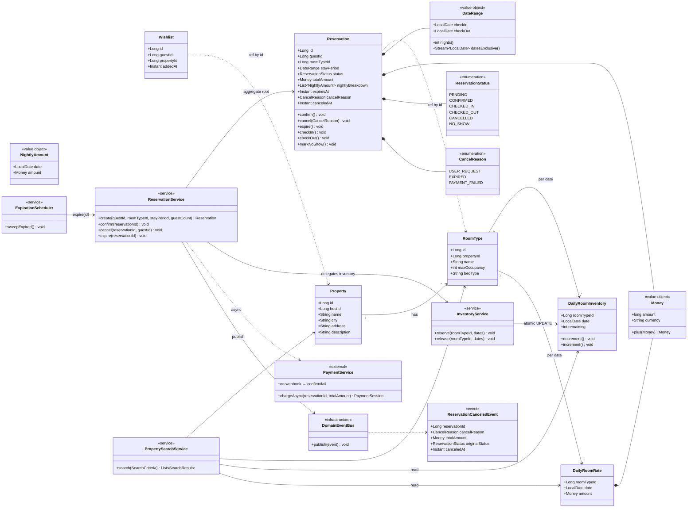

# 03. 클래스 다이어그램 (도메인 객체 설계)

> 기준 문서: `01-requirements.md`, `02-sequence-diagrams.md`
> 표현: Mermaid `classDiagram`
> 다이어그램 작성 기준: `.claude/skills/requirements-analysis/SKILL.md` § 5️⃣

---

## 한눈에 보기 (비개발자용)

이 문서는 "**숙박 예약 도메인에서 누가 무엇을 책임지는가**"를 객체 단위로 그린 그림이다. 코드를 모르더라도 다음 7명의 등장인물이 어떤 역할을 하는지만 알면 시스템 흐름이 잡힌다.

| 등장인물 | 역할 (한 줄로) |
|---------|----------------|
| **Property (숙소)** | 호텔/펜션 같은 판매 단위. 도시·이름·주소를 가지고 있다. |
| **RoomType (객실 타입)** | 한 숙소가 파는 객실 카테고리. 최대 인원과 침대 종류를 안다. |
| **DailyRoomInventory (일자별 재고)** | "이 객실 타입에 이 날짜에 몇 개 남았는가"를 기억한다. **더블부킹 방지의 최후 방어선.** |
| **DailyRoomRate (일자별 요금)** | "이 객실 타입에 이 날짜 1박 가격은 얼마인가"를 기억한다. |
| **Reservation (예약)** | 게스트가 객실을 점유한 계약. **상태(대기/확정/체크인/체크아웃/취소/노쇼)를 본인이 직접 관리.** |
| **ReservationNightly (예약 일자 스냅샷)** | 예약 시점의 일자별 가격을 박제. 나중에 환불 계산의 기반이 된다. |
| **Wishlist (찜)** | 게스트가 숙소를 즐겨찾기한 기록. |

그리고 이 도메인 객체들을 묶어서 일하는 **5명의 서비스 책임자**가 있다.

| 서비스 | 책임 (한 줄로) |
|--------|----------------|
| **PropertySearchService** | 사용자의 검색 조건으로 위 객체들을 조회·합산해 결과를 만든다. |
| **ReservationService** | 예약의 생애주기(생성·확정·취소·만료) 전체를 지휘한다. |
| **InventoryService** | 일자별 재고를 차감·복구하는 단독 책임자. 동시성 보장을 여기서만 한다. |
| **ExpirationScheduler** | 결제 안 한 PENDING 예약을 10분 후에 정리하는 청소부. |
| **PaymentGateway (외부)** | 외부 결제 시스템. 결과를 webhook으로 알려준다. |

### 가장 중요한 약속

> **`Reservation`은 `DailyRoomInventory`를 직접 만지지 않는다.**

이게 이번 도메인의 핵심 책임 분리다. 예약 도메인이 재고 테이블을 직접 수정하면 동시성 코드가 여기저기 흩어지므로, 재고 변경은 **InventoryService 단독**이 처리한다. 사람으로 비유하면 "예약 담당자는 재고 창고에 직접 들어가지 않고, 창고지기에게만 요청한다"는 규칙이다.

---

## 0. 설계 원칙

- **Aggregate 경계**: 트랜잭션 일관성이 필요한 단위를 aggregate로 묶고, aggregate 간에는 **ID 참조**만 한다.
- **불변식 보호 위치**: 상태 머신·도메인 규칙은 모델(`Reservation`, `DailyRoomInventory`)에 응집. 서비스는 트랜잭션 경계와 외부 협력만 담당.
- **Value Object**: 의미 있는 단순값(`DateRange`, `Money`)은 VO로 분리해 검증·연산 응집.
- **Service 역할 분리**: 검색 / 예약 / 재고 / 만료 정리 / 결제(외부)를 별도 서비스로 둔다 — 책임 경계가 시퀀스와 1:1로 매칭.

## 1. 클래스 다이어그램

### 이 다이어그램이 필요한 이유

- "어느 클래스가 무슨 규칙을 보호하는가"를 한눈에 확인한다. 시퀀스에서 흩어진 호출이 어디로 모이는지를 보고 응집도를 검증한다.
- aggregate 경계가 합의(B1, B5)와 일치하는지 — 특히 `Reservation`이 `DailyRoomInventory`를 직접 만지지 않는다는 점.

### 다이어그램

## 2. 이 구조에서 특히 봐야 할 포인트

1. **`Reservation`은 `DailyRoomInventory`를 직접 모르고 있다** — 점선 의존조차 없음. 재고 차감은 `ReservationService → InventoryService → DailyRoomInventory`로만 일어난다. B1 합의의 코드 단위 표현.
2. **`DailyRoomInventory`의 `decrement/increment`는 SQL 한 줄로 구현되는 도메인 행위** — JPA에서는 `@Modifying @Query`로 직접 작성하거나, `Inventory` aggregate가 atomic SQL을 호출하는 방식. ORM에 끌려가지 않고 도메인의 의도를 코드에 남긴다.
3. **상태 머신은 `Reservation` 안에 응집** — `confirm/cancel/expire/checkIn/checkOut/markNoShow` 각 메서드가 전이 조건을 자체 검증. 컨트롤러·서비스가 상태를 외부에서 set 하지 못하게 한다 (setter 미노출 가정).
4. **도메인 이벤트는 `DomainEventBus`를 통해 발행** — `ReservationCanceledEvent`는 외부 환불·알림·통계 모듈의 진입점. ERD 단계에서 outbox 테이블과 매핑.
5. **`PropertySearchService`는 4개 영속 모델을 모두 read만 한다** — 검색 결과 DTO(`SearchResult`)로 가공해 반환. 검색용 모델을 별도로 두지 않고 영속 모델을 직접 조회하는 단순한 구조 (성능 한계 시 read model 분리 후보).

## 3. 잠재 리스크

- **Reservation aggregate가 비대해질 가능성** — 상태 머신 + 결제 스냅샷 + 만료 timer + 취소 사유까지 한 클래스. 라운드 3 이후 환불·정산·로열티가 붙으면 분리 후보 (`CancellationPolicy`, `PaymentSnapshot`).
- **`Property`/`RoomType` 변경 시점이 모호** — 운영자가 객실 정보를 수정하면 진행 중인 `PENDING/CONFIRMED` 예약은? B2(스냅샷)로 가격은 보호되지만, `bedType`·`maxOccupancy` 같은 메타는 진행 중 예약과 정합성이 깨질 수 있음. 이번 라운드는 "운영자 수정은 신규 예약부터 반영"으로 가정.
- **`InventoryService`의 atomic UPDATE가 RDB에 강하게 종속** — 다중 인스턴스 RDB 또는 분산 환경 진입 시 단일 SQL이 충분하지 않을 수 있음. 그때는 Redis 분산 락 또는 sharding 도입을 검토 (이번 라운드 범위 외).
